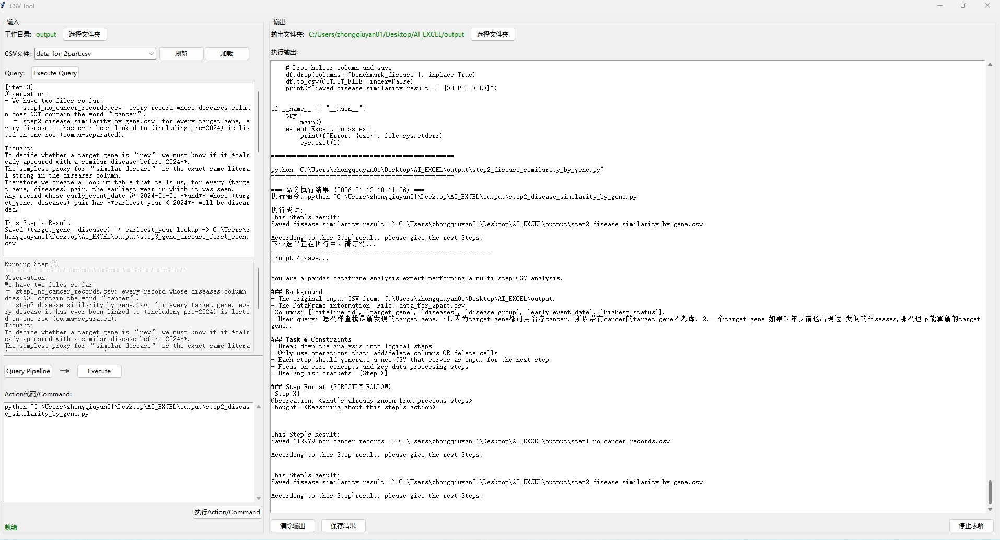

# AI CSV: ReAct-based AI agent for Excel/CSV with SQL queries & auto code generation

This is an intelligent agent designed for CSV data analysis.

For simple information queries:

Enter your question in the 'Query' field below and click the 'Execute Query' button. The corresponding code will be generated in the 'Action Code/Command' section. Click 'Execute Action/Command' to run the code and view results in the output area. Repeat this process step by step until your question is fully resolved.

For complex analytical tasks:

Type your complex question and click 'Query Pipeline'. The system will decompose your task into manageable steps. Click 'Execute' to process each step - the corresponding code will appear in the right panel. Click 'Execute Action/Command' to generate new CSV files. Iterate through each step, generating intermediate CSV files as needed, until your complete analytical task is solved.
Core capability: The agent searches for optimal solutions online and transforms them into executable local scripts for your data analysis needs. 

## How it works

Step 1: Apply (a) local file analysis, (b) LLM models and (c) web-searching to find solution for users' questions, e.g. downloading some data or performing differential expression analysis

Step 2: Transform the solutions into one python, which will be stored as local file

Step 3: Prepare local command and run the script (!the command is only runned in local server!)

Step 4: If any error is returned by system, using LLM to revise the script and generate new script.

Setp 5: if works, waiting for new round of questions

## Install

1. python >3.11
2. Dependence
   ```bash
   pip install -r requirements.txt
   ```

## Usage

   ```bash
   python run_excel.py
   ```



## Limitation

(1) In current version, the web searching tool is based on moonshot API (https://platform.moonshot.cn/docs/introduction). If you need other LLM models, please modify the 'reasoning_web_search' function. 

(2) UI interface is in Chinese. 
